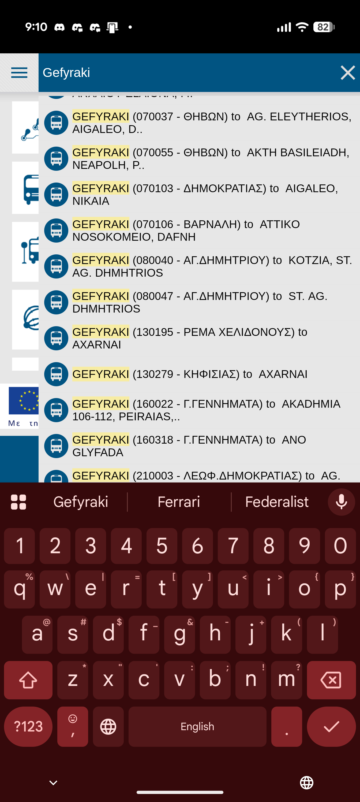
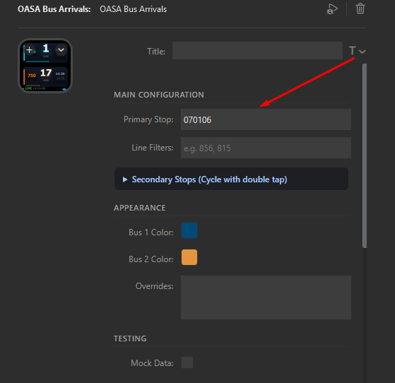

# OASA Bus Arrivals - Stream Deck Plugin 🚌

Track live bus and trolley arrivals in Athens (OASA Telematics) directly on your Elgato Stream Deck button!

Get real-time arrival countdowns, scheduled departure times, custom line colors, and the ability to cycle through multiple stops with a double-tap.

---

## 🚀 Quick Setup Guide (Step-by-Step)

Setting up your bus stop takes less than **1 minute**!

### Step 1: Install the Plugin
1. Download the latest `com.miketsakgr.oasa-bus.streamDeckPlugin` file from [Releases](https://github.com/MikeTsak/oasa-Stream-Deck/releases).
2. Double-click the downloaded file — Elgato Stream Deck will install it automatically.
3. In your Stream Deck app, find **OASA Bus** in the right sidebar and drag it onto any key.

---

### Step 2: Find Your 6-Digit Stop Code 🚏

To show arrival times, the plugin needs your 6-digit bus stop number (e.g. `070106`). Here are the **2 easy ways** to find it:

#### 📱 Method A: Using the OASA Telematics Mobile App (Recommended)
1. Open the **OASA Telematics** app on your phone (Android / iOS).
2. In the search bar at the top, type the name of your stop (e.g. `Gefyraki` or `Syntagma`).
3. Look at the search results: **the 6-digit number in parentheses is your Stop Code**!
   - *Example:* `GEFYRAKI (070106 - ΒΑΡΝΑΛΗ)` ➔ Your stop code is **`070106`**.

<p align="center">
  
</p>

---

#### 🌐 Method B: From the Website or Physical Stop Sign
- **On the Web:** Go to [telematics.oasa.gr](https://telematics.oasa.gr/), search for your bus line, click on your stop, and copy the 6-digit code.
- **At the Bus Stop:** Look at the metal OASA sign or smart telematics display at your stop — the 6-digit stop code is printed right at the top!

---

### Step 3: Paste Your Stop Code in Stream Deck ⚡

1. Click on the OASA Bus key in your Stream Deck software to open its settings below.
2. Type or paste your 6-digit stop code into the **Primary Stop** box.
3. That's it! Your Stream Deck key will immediately fetch and display the live bus arrivals!

<p align="center">
  
</p>

---

## 🎮 How to Control Your Key

| What you do | What happens |
|---|---|
| **Single Press (1 Tap)** | **Scrolls to the next buses** (if more than 2 buses are arriving at this stop) |
| **Double Tap (2 Quick Clicks)** | **Switches to your next stop** (if you added secondary stops in settings) |
| **Long Press (Hold for 5s)** | **Forces an immediate live refresh** (a green circle animation will show progress) |

---

## ⚙️ Extra Features & Customization (Optional)

Click your button in the Stream Deck software to open the settings panel for optional power features:

### 1. Multiple Stops on One Key
Have a morning stop near your house and an afternoon stop near your office?
- Open the **Secondary Stops** dropdown in settings.
- Add up to 4 extra stop codes (Stop 2, Stop 3, Stop 4, Stop 5).
- Simply **double-tap** your Stream Deck key anytime to cycle between them!

### 2. Filter Specific Bus Lines
If a stop has 10 different buses but you only take the `856` and `750`:
- In the **Line Filters** box, write: `856, 750`
- The key will only show arrival times for those specific lines.

### 3. Custom Colors & Names (Line Overrides)
Make your favorite buses stand out with custom colors and labels:
- Under **Overrides**, write one line per bus in this format: `LineNumber,ColorHex,CustomLabel`
- *Example:*
  ```csv
  856,#00E5FF,856
  750,#FF6B00,ΑΤΤΙΚΟ
  049,#004A77,ΠΕΙΡΑΙΑΣ
  ```

### 4. Testing Mode (Mock Data)
Check the **Mock Data** box to preview animations and custom colors even when no buses are running late at night.

---

## ✨ Key Highlights

- 🕒 **Always Accurate**: Automatically polls every 90 seconds (1:30 min) in the background with zero screen flickering.
- 📅 **Scheduled Departures Fallback**: If a bus hasn't started its route yet, the widget automatically displays upcoming scheduled terminal departures.
- 🔋 **OLED-Optimized**: Crisp, high-contrast dark design tailored for Elgato Stream Deck displays.
- 🟢 **Live Status Indicator**: A subtle timestamp and live indicator on the bottom tells you exactly when data was updated.

---

## 🛠️ For Developers

```bash
# Install dependencies
npm install

# Watch mode (auto-rebuilds and restarts plugin on code changes)
npm run watch

# Production build
npm run build

# Package into .streamDeckPlugin
npm run pack
```

---

*Made with ❤️ by [MikeTsak](https://miketsak.gr)*
